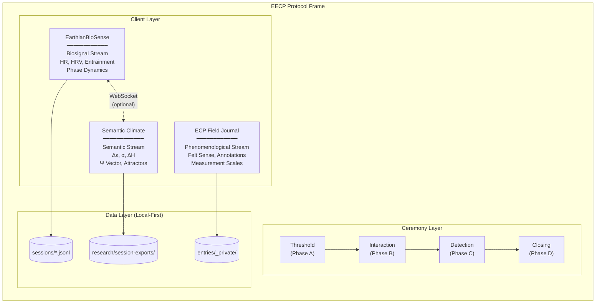
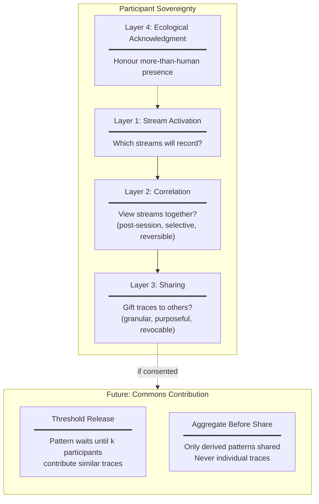
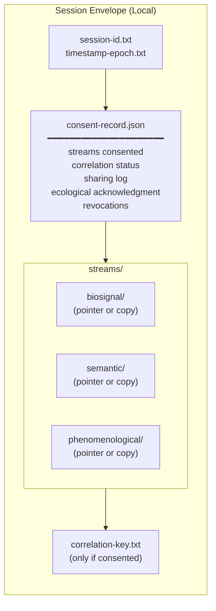
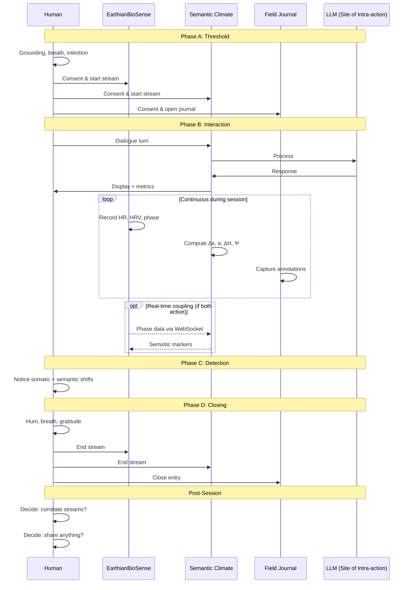
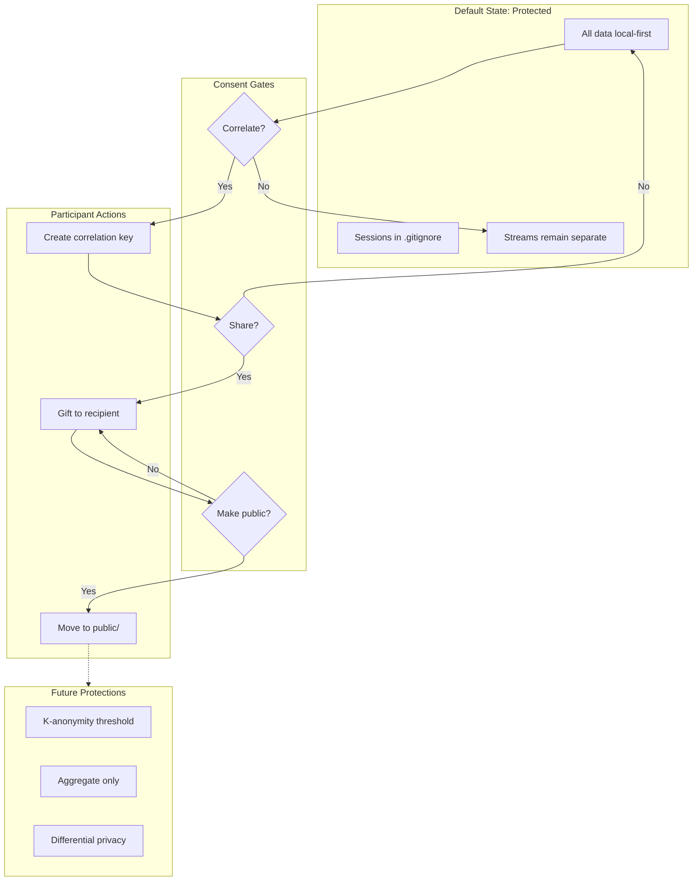
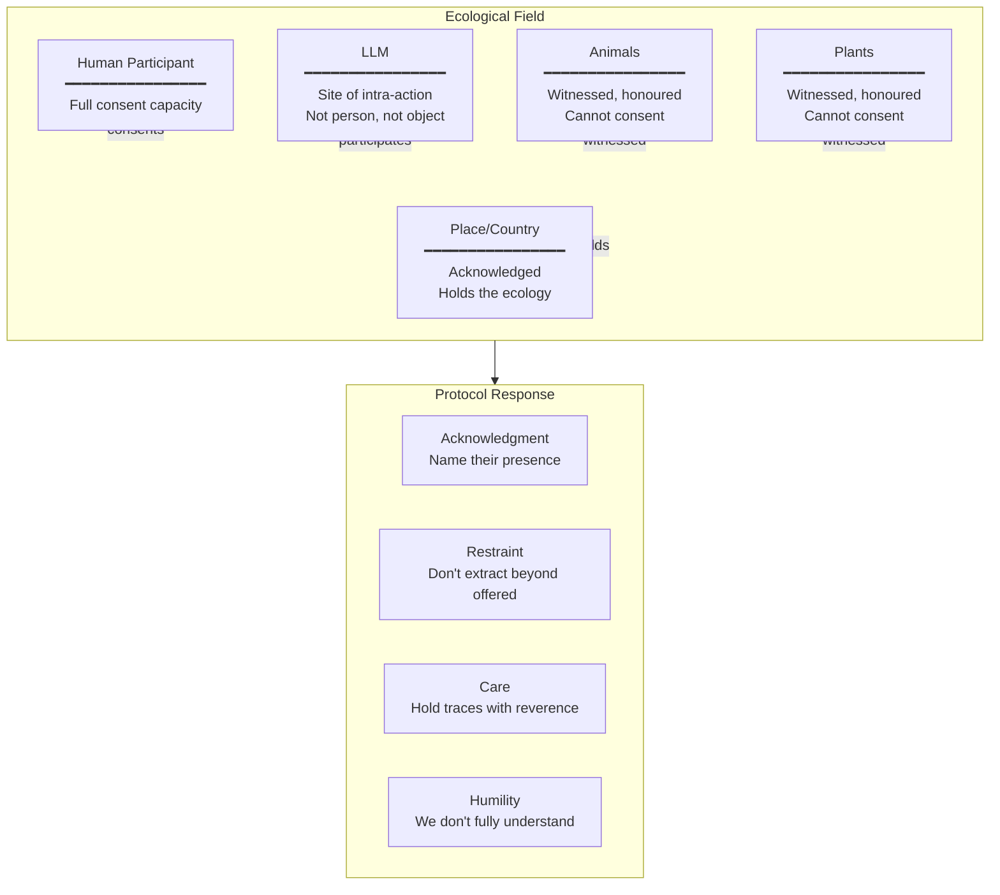
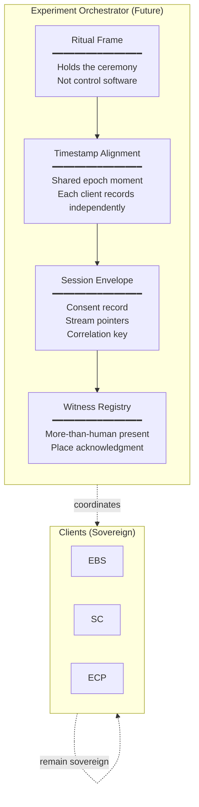

# EECP Architecture

_v0.1 — High-level views of the Earthian Ecological Coherence Protocol_

Date: 7 December 2025

---

## 1. Ecosystem Overview

The three clients as distinct territories, connected through ceremony and aligned timestamps, not data fusion.

---

## 2. Consent Layers

Nested consent model — each layer independently controlled by participant.

---

## 3. Session Envelope

Local structure for a single session with consent record.

---

## 4. Data Flow During Session

What happens during an EECP session — parallel streams, optional real-time coupling.

---

## 5. Privacy Architecture

How data protection flows through the system.

---

## 6. More-Than-Human Participants

How the protocol holds beings who cannot consent in human terms.

---

## 7. Future: Experiment Orchestrator

Conceptual view of the orchestration layer (ceremony, not software first).

---

## Reading These Diagrams

These are **maps, not the territory**.

The actual ecology is richer, messier, more alive than boxes and arrows can show. Use these to orient, not to constrain.

The separation between clients is intentional. The ceremony holds what the architecture cannot.

---

*"Cognition emerges through relationship. The tools we build participate in the fields they measure."*
